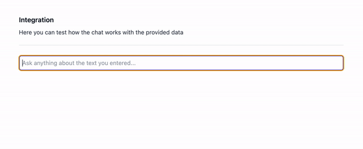

## What is AI ChatBot ?

With this app, you can create your chatbot by providing a set of texts that the chatbot will use to generate responses.

Will will illustrate this with an example.

👉 We have added a couple of texts that contain car names, their value and rating:

  
  </br>
  </br>

👉 Now we can ask the chatbot a question and it will use all the knowledge provided to generate a response:



## Setup

This project is loosely based on [ai-getting-started](https://github.com/a16z-infra/ai-getting-started/) repo. Therefore is a part of the setup similar to the original repo.

Used stack is:

- [OpenAI](https://platform.openai.com/docs/models) - text generation
- [Clerk](https://clerk.com/) - authentication
- [Supabase](https://supabase.com/) - Database
- [Next.js](https://nextjs.org/) - Frontend & API

### 1. Install dependencies

```
npm install
```

### 2. Fill out secrets

```
cp .env.local.example .env.local
```

a. **Clerk Secrets**

Go to https://dashboard.clerk.com/ -> "Add Application" -> Fill in Application name/select how your users should sign in -> Create Application
Now you should see both `NEXT_PUBLIC_CLERK_PUBLISHABLE_KEY` and `CLERK_SECRET_KEY` on the screen
b. **OpenAI API key**

Visit https://platform.openai.com/account/api-keys to get your OpenAI API key

e. **Supabase API key**

- Create a Supabase instance [here](https://supabase.com/dashboard/projects); then go to Project Settings -> API
- `SUPABASE_URL` is the URL value under "Project URL"
- `SUPABASE_PRIVATE_KEY` is the key starts with `ey` under Project API Keys
- Now, you should enable pgvector on Supabase and create a schema. You can do this easily by clicking on "SQL editor" on the left hand side on supabase UI and then clicking on "+New Query". Copy paste [this code snippet](scripts/supabase.sql) in the SQL editor and click "Run".

### 3. Run app locally

Now you are ready to test out the app locally! To do this, simply run:

```
npm run dev
```
